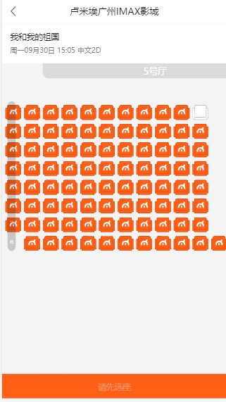
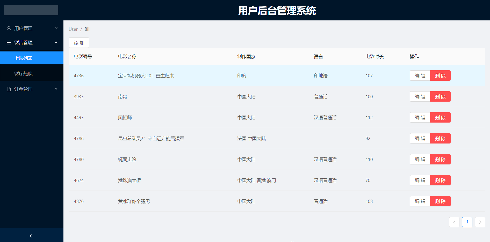
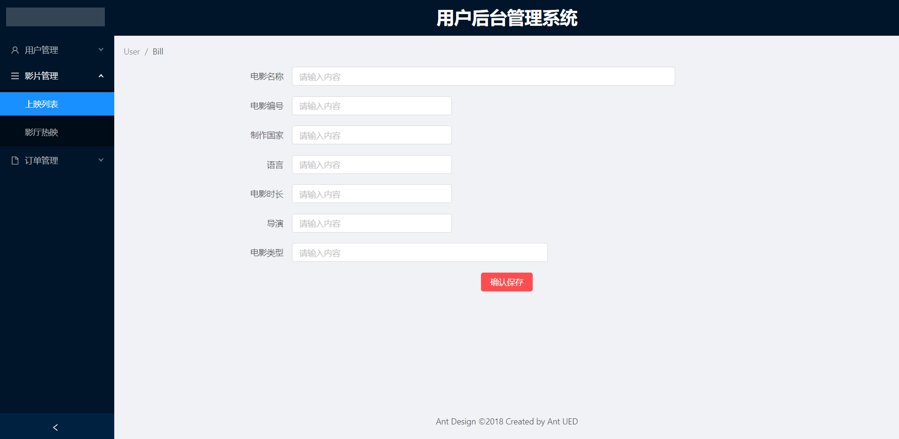
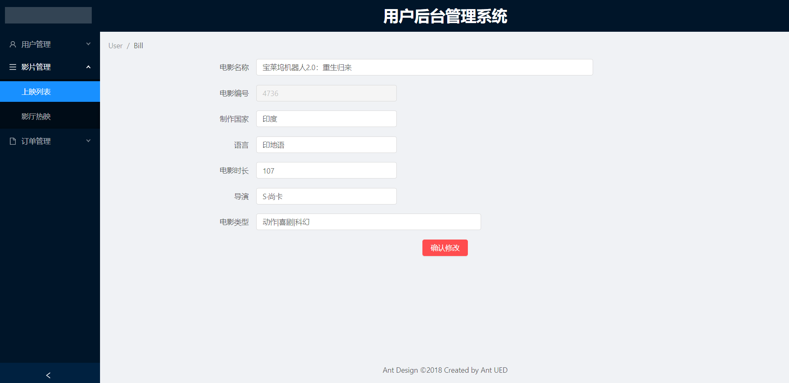

# Vue项目--maizuo（卖座）+ 后台管理系统

## 项目演示
 *   官网：  https://m.maizuo.com
 *   项目上线网址：  http://47.96.238.230:1908/#/film/nowplaying

## git仓管地址
 *   地址: git@github.com:gzh51906/Maizuo.git

## 团队与分工
 * 组长：余晓东，成员：黎文德，黄冰群，李俊升
 * 余晓东负责app项目的'电影院'组件部分，电影院分城区，电影选座，电影院上映详情，购票结算页面。后台负责的是订单列表，影院列表，热映列表及接口的编写，思密达。
 * 黎文德负责app项目开发环境的搭建，完成了app项目'我的'组件的开发，完成了登录注册功能，鉴权，app项目首页的开发。
 * 黄冰群负责后台管理系统项目的'登陆'组件部分，登陆鉴权，token校验。
 * 李俊升负责后台管理系统项目的开发环境的搭建，电影列表页数据渲染及增删改查，接口的编写。

 ## 项目页截图

-------
 * 首页
   + 

* 电影
   +  

* 电影院选购
   +  

* 选座
   +  

* 
   +  

* 
   +  

* 
   +  

* 
   +  


## 项目目录说明
```js
.
|-- README.md
|-- debug.log
|-- dist
|   |-- bundle-main-ec0f9.js
|   `-- index.html
|-- doc
|   |-- data.js
|   `-- film.json
|-- nodejs
|   |-- package-lock.json
|   |-- package.json
|   `-- src
|       |-- config.json
|       |-- db
|       |   |-- mongo.js
|       |   `-- mysql.js
|       |-- index.html
|       |-- router
|       |   |-- cartlist.js
|       |   |-- cinema.js
|       |   |-- film.js
|       |   |-- goods.1.js
|       |   |-- goods.js
|       |   |-- index.js
|       |   `-- user.js
|       |-- server.js
|       `-- utils
|           |-- index.js
|           `-- token.js
|-- package-lock.json
|-- package.json
|-- src
|   |-- App.jsx
|   |-- api
|   |   `-- index.js
|   |-- asset
|   |   |-- film.json
|   |   |-- font_p8eg234wy9
|   |   |   `-- iconfont.woff2
|   |   |-- img
|   |   |   `-- zx.jpg
|   |   |-- inforImg
|   |   |   `-- samll9.jpg
|   |   `-- mineimg
|   |       `-- \317\302\324\330.png
|   |-- component
|   |   `-- ComponentButtom
|   |       |-- ComponentButtom.css
|   |       |-- ComponentButtom.jsx
|   |       `-- ComponentButtom.scss
|   |-- main.js
|   |-- pages
|   |   |-- cinema
|   |   |   |-- Cinema.jsx
|   |   |   |-- cinema.css
|   |   |   `-- cinema.scss
|   |   |-- cinemadetail
|   |   |   |-- Cinemadetail.jsx
|   |   |   |-- cinemadetail.css
|   |   |   `-- cinemadetail.scss
|   |   |-- film
|   |   |   |-- Film.jsx
|   |   |   |-- component
|   |   |   |   |-- ComingSoon.jsx
|   |   |   |   |-- Nowplaying.jsx
|   |   |   |   |-- nowplaying.css
|   |   |   |   `-- nowplaying.scss
|   |   |   |-- film.css
|   |   |   `-- film.scss
|   |   |-- filmDetail
|   |   |   |-- filmDetail.css
|   |   |   |-- filmDetail.jsx
|   |   |   `-- filmDetail.scss
|   |   |-- information
|   |   |   |-- Information.jsx
|   |   |   |-- information.css
|   |   |   `-- information.scss
|   |   |-- login
|   |   |   |-- Login.jsx
|   |   |   |-- login.css
|   |   |   `-- login.scss
|   |   |-- mine
|   |   |   |-- Mine.jsx
|   |   |   |-- mine.css
|   |   |   `-- mine.scss
|   |   |-- orderlist
|   |   |   |-- Orderlist.jsx
|   |   |   |-- orderlist.css
|   |   |   `-- orderlist.scss
|   |   |-- schedule
|   |   |   |-- Schedule.jsx
|   |   |   |-- iconfont.css
|   |   |   |-- schedule.css
|   |   |   `-- schedule.scss
|   |   `-- user
|   |       |-- Setting.jsx
|   |       |-- User.jsx
|   |       |-- component
|   |       |   |-- order.css
|   |       |   |-- order.jsx
|   |       |   `-- order.scss
|   |       |-- setting.css
|   |       |-- setting.scss
|   |       |-- user.css
|   |       `-- user.scss
|   |-- redux
|   |   |-- reducer
|   |   |   |-- cart.js
|   |   |   |-- cinema.js
|   |   |   |-- common.js
|   |   |   |-- index.js
|   |   |   `-- user.js
|   |   |-- rootSage.js
|   |   `-- store.js
|   |-- rem.js
|   |-- style
|   |   |-- common.css
|   |   `-- common.scss
|   `-- template.html
`-- webpack.config.js

```

